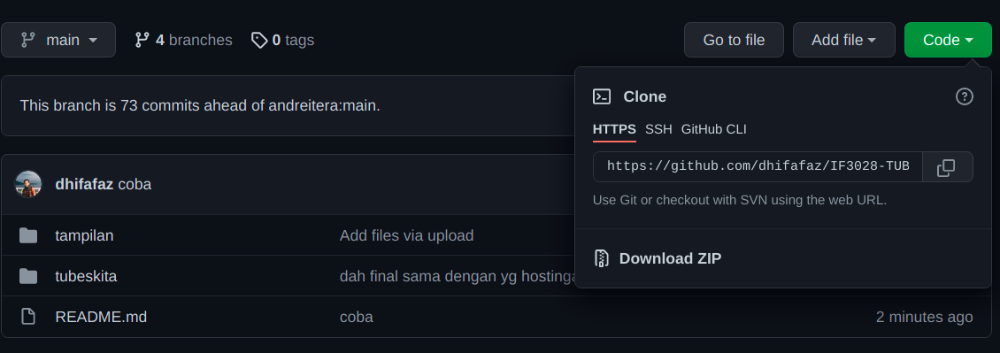
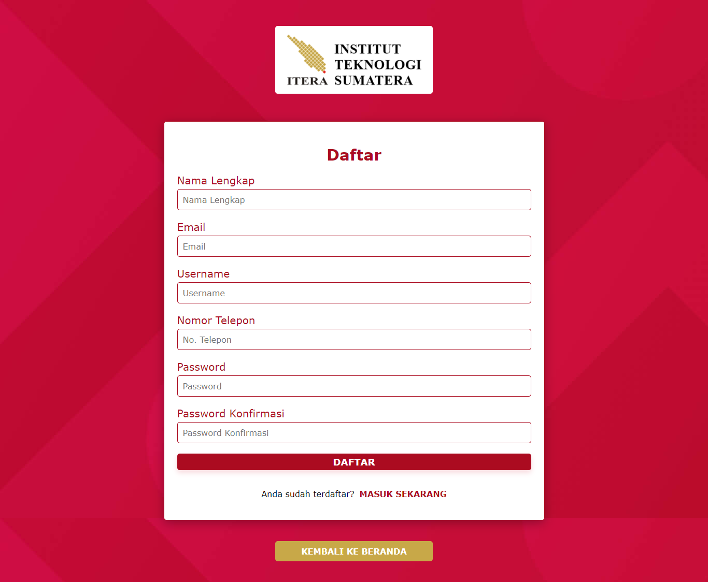
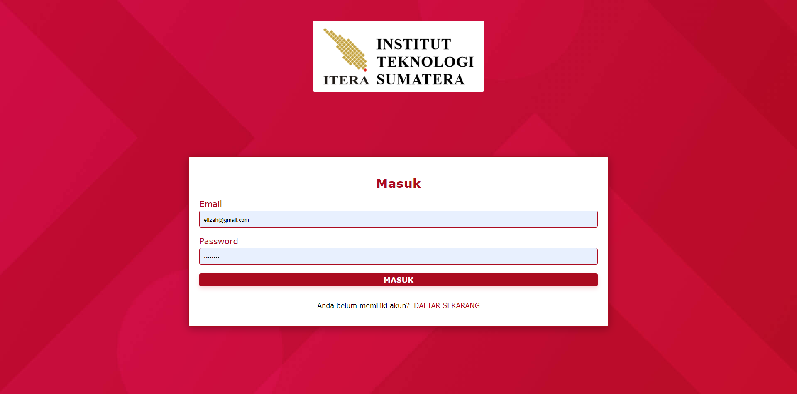
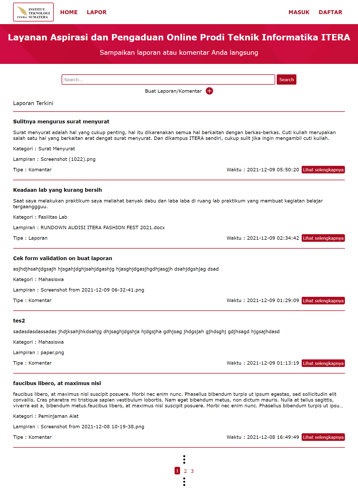

## Simple `LAPOR` :heavy_exclamation_mark:
Anda mengetahui aplikasi `lapor` yang dibuat oleh pemerintah republik indonesia? jika tidak silahkan kunjungi 
http://lapor.go.id, maka anda akan mendapatkan laman seperti gambar di bawah


Kali ini kita akan membuat aplikasi web seperti `lapor` untuk mengumpulkan laporan/komentar terkait layanan
di program studi teknik informatika ITERA.
**Luangkan waktu untuk membaca spesifikasi ini sampai selesai.** :kissing_heart:

### Anggota Tim :cyclone:
Project dikerjakan secara **berkelompok** dengan maksimal jumlah anggota adalah 2-3 orang mahasiswa (maksimal 3 orang mahasiswa!).

### Petunjuk Pengerjaan :umbrella:
1. Fork pada repository ini dengan akun github anda.
2. Silakan commit pada repository anda (hasil fork). Lakukan berberapa commit dengan pesan yang bermakna,
contoh: fix css, membuat post done, jangan seperti final, benerin dikit, oke deh, update deh dll. 
Disarankan untuk tidak melakukan commit dengan perubahan yang besar karena akan mempengaruhi 
penilaian (contoh: hanya melakukan satu commit kemudian dikumpulkan).
3. Minimal commit sebanyak personil anggota tim dengan masing-masing personil tim melakukan commit sesuai dengan kesepakatan tim, penilaian individu akan dilihat.
4. Ubah **Penjelasan Teknis** pada bagian bawah readme.md ini dengan menjelaskan bagaimana cara anda:
   - Instalasi Framework, Koneksi basis data 
   - Melakukan validasi pada client-side
   - Melakukan AJAX (mulai dari pengguna melakukan klik pada tombol LAPOR! sampai laporan/komentar terkirim).
5. Pull request dari repository anda ke repository ini dengan 
format **NIM** - **Nama Lengkap**. **Waktu terkahir proses pull request adalah 4 hari setelah 
ujian akhir semester (UAS)**
6. Data yang dikumpulkan adalah:
   - Source code aplikasi
   - Basis data, dan
   - Cara instalasi aplikasi anda
7. Penilaian:
   - Kerjasama tim
   - Kesesuaian dengan spesifikasi
   - Pemahaman dalam penggunaan framework, penilaian efisiensi query
   - Antarmuka aplikasi
   - Bug free :beetle:
   
### Tools :hammer:
1. Untuk backend, wajib menggunakan PHP framework apapun (Contoh: Codeigniter, Laravel, Slim, Yii dll).
2. Gunakan MySQL atau basis data relasional lain untuk menyimpan data.
3. Untuk frontend, gunakan Javascript, HTML dan CSS. **Tidak boleh menggunakan library atau framework CSS atau JS seperti 
JQuery atau Bootstrap.** CSS sebisa mungkin ada di file yang berbeda (tidak inline styling/embeding styling).

### Spesifikasi Simple LAPOR!
#### Tampilan :soccer:
Anda diminta untuk membuat tampilan sedemikian hingga mirip dengan tampilan berikut. Website yang diminta tidak harus 
responsive. Desain tampilan tidak perlu dibuat indah. Icon dan jenis font tidak harus sama dengan contoh. Warna font, 
garis pemisah, dan perbedaan ukuran font harus terlihat sesuai contoh. Perhatikan juga tata letak elemen-elemen.


- Search bar diletakkan di bagian paling atas dibawah judul.
- Tombol "cari" berada di sebelah kanan search bar.
- **Buat LAPOR!** digunakan untuk mengirimkan laporan/komentar baru.
- Tampilan search bar ini harus tetap ada walaupun anda tidak mengimplementasikan fitur search.
- Tampilan pertanyaan tidak harus urut berdasarkan "Laporan/Komentar terakhir", 
namun tulisan "Laporan/komentar Terakhir" ini harus ada.


- Tampilan di atas digunakan untuk mengajukan atau mengubah laporan/komentar.
- Perhatikan label dari field pada form berada di dalam field (tidak di luar)
- Apek yang dilaporkan ditampilkan dalam bentuk `select`


- Bagian ini menampilkan laporan/komentar. Bagian `datetime` harus ada. Tanda `kuote` tidak harus ada
- Perhatikan label dari field pada form berada di dalam field (tidak di luar)

### List laporan/komentar
Halaman utama berisi daftar judul pertanyaan, siapa yang bertanya, dan isi pertanyaan. Isi pertanyaan yang terlalu 
panjang harus dipotong. Silakan definisikan sendiri seberapa panjang agar tetap baik terlihat di layout yang Anda buat.

Pada masing-masing elemen list, terdapat menu untuk mengubah dan menghapus pertanyaan.

View Laporan ditampilkan secara terurut dimulai dari laporan terakhir yang diberikan highlight

### Kirim laporan/komentar `LAPOR!`
Pengguna dapat mengajukan laporan/komentar. Form yang digunakan memiliki komentar (textarea), 
data lapiran berupa gambar 
dan file berekstention `doc, docx, xls, xlsx, ppt, pptx, pdf``. Gunakan HTTP POST.

### Ubah Laporan/komentar
Pengguna dapat mengubah laporan/komentar yang sudah dibuat. Form yang digunakan memiliki tampilan yang sama dengan 
form untuk bertanya, namun field-field yang ada sudah terisi. Gunakan HTTP POST untuk menyimpan perubahan.

### Hapus Laporan/komentar
Pengguna dapat menghapus laporan/komentar yang sudah dibuat. Lakukan konfirmasi penghapusan dengan `javascript`.

### Lihat Laporan/komentar
Pengguna dapat melihat laporan/komentar. Pada halaman ini terdapat informasi aspek yang dilaporkan.
(Dosen, Staff, Mahasiswa, Infrastruktur dan Pengajaran ), isi laporan/komentar, waktu pengiriman komentar `datetime` 
dan file lapiran. 

### Validasi
Validasi **wajib** dilakukan pada *client-side*, dengan menggunakan **javascript** bukan HTML 5 input type, yaitu:
- Setiap field pada form tidak boleh kosong.
- minimal jumlah kata dalam laporan/komentar adalah 20 kata.

### Bonus
Pengguna dapat mencari laporan/komentar dengan melakukan search ke `isi laporan/komentar`.

### Penjelasan Teknis
#### 1. Clone repo GitHub ini sehingga bisa di akses secara lokal
Bisa dilakukan dengan dua cara yaitu melalui command prompt atau pun dengan langsung mengunjungi link repositori yang ada di GitHub.
- Dengan menggunakan command promt atau terminal, yang perlu dilakukan adalah memasukkan sintaks seperti dibawah ini.

```
git clone https://github.com/dhifafaz/IF3028-TUBESPEMWEB-RD-21-22.git
```

- Dengan langsung mengunjungi link repositori yang ada dan mengklik tombol hijau bertuliskan "clone or download" pada bagian kanan.



#### 2. cd ke folder project laravel
Untuk dapat menjalankan project laravel nantinya perlu dijalankan perintah-perintah artisan dan composer yang hanya akan berjalan ketika kita berada dalam folder dari project laravel itu sendiri. Masukkan perintah berikut pada terminal atau CMD.

```
cd tubeskita
```

#### 3. Langkah selanjutnya adalah instalasi project dependencies
Karena baru saja di clone dari GitHub sehingga folder dependencies yang ada di lokal komputer pemilik repo tidak ikut terupload karena ukuran file cukup besar dan dihalangi oleh gitignore. Sehingga langkah selanjutnya adalah melakukan instalasi dari dependensi composer. Masukkan perintah berikut ke terminal atau CMD.

```
composer install
```

#### 4. Mengkopi file .env.example
Untuk menjalankan project laravel selanjutnya yang perlu dilakukan adalah melakukan konfigurasi dari environtment yang akan digunakan oleh project. Masukkan perintah berikut ke terminal atau CMD.

```
cp .env.example .env
```
Hasil dari kopian file tersebut terdapat settingan database yang akan digunakan, dalam hal ini kami telah mengatur database yang akan digunakan merupakan database remote yang di hosting pada sebuah server. Sehingga tidak perlu dilakukannya migrasi database dari laravel itu sendiri. Namun apabila ingin menggunakan database lokal bisa dengan membuat terlebih dahulu database kosong kemudian melakukan perubahan pada bagian berikut dari file .env yang ada.

```
DB_CONNECTION=mysql
DB_HOST=remotemysql.com
DB_PORT=3306
DB_DATABASE=E91uCu8t1k
DB_USERNAME=E91uCu8t1k
DB_PASSWORD=p7Bd2nm91e
```

Serta mengikuti langkah selanjutnya yang ada dibawah nanti terkait migrasi database.

#### 5. Men-generate kunci enkripsi aplikasi
Laravel membutuhkan app encription key yang mana akan digenerate secara acak dan disimpan dalam file .env yang sudah ada. Aplikasi nantinya akan menggunakan kunci tersebut untuk meng-encode berbagai element yang ada. Untuk melakukannya cukup memasukkan perintah berikut ke terminal atau CMD.

```
php artisan key:generate
```

#### 6. Migrasi database
Kelanjutan dari step 4 sebelumnya, apabila ingin menggunakan database lokal maka langkah selanjutnya adalah melakukan migrasi database agar tabel yang dibuat sesuai dengan ketentuan yang sudah dibangun sebelumnya. Berikut adalah sintaks yang perlu dijalankan pada terminal atau CMD.

```
php artisan migrate
```

Dan terakhir apabila ingin menggunakan isi dari database yang sudah kami buat bisa melakukan import file mysql yang ada dan telah kami masukkan ke dalam repo ini.

### Penjelasan aplikasi dan fiturnya

#### 1. Fitur Registrasi

Fitur berikut merupakan fitur registrasi website Lapor Prodi Teknik Informatika yang berfungsi untuk memasukkan data-data pribadi bagi pengguna yang ingin membuat akun baru.

#### 2. Fitur Masuk

Fitur berikut merupakan fitur Login website Lapor Prodi Teknik Informatika yang berfungsi untuk masuk ke website dengan cara memasukkan password dan email pengguna. Dalam page Login juga disediakan fitur untuk masuk ke page registrasi jika pengguna belum memiliki akun.

#### 3. Fitur Home

Fitur berikut merupakan fitur Home website Lapor Prodi Teknik Informatika yang berfungsi untuk menampilkan laporan atau komentar yang sudah dibuat oleh pengguna website. Di dalam page home juga di sediakan fitur untuk membuat laporan atau komentar, sehingga ketika pengguna mengklik fitur "Buat laporan/komentar" maka akan  berpindah ke page "Buat laporan/komentar". Di dalam page home juga disediakan fitur "search" yang berfungsi untuk mencari judul laporan yang sudah dibuat oleh pengguna website. Selain itu di dalam page home ini juga disediakan fitur untuk melihat detail laporan yang sudah dibuat oleh para pengguna website.

#### 4. Fitur Buat Laporan/Komentar

Fitur berikut merupakan fitur Buat Laporan/Komentar website Lapor Prodi Teknik Informatika yang berfungsi untuk membuat laporan atau komentar secara lengkap. Di dalam fitur ini pengguna dapat memaparkan laporan atau komentar mereka secara lengkap. Kemudian pengguna juga dapat memasukkan tanggal saat mereka membuat laporan. Selain itu pengguna juga dapat mengirim file sebagai bukti untuk memperkuat laporan mereka. Pengguna juga dapat menyembunyikan identitas asli mereka ketika ingin mengirim Laporan ataupun Komentar.

#### 5. Fitur Detail Laporan
Fitur berikut merupakan fitur Detail Laporan website Lapor Prodi Teknik Informatika yang berfungsi untuk melihat laporan secara lengkap. Pengguna dapat melihat waktu saat laporan dikirimkan. Kemudian dapat melihat ataupun mendownload file yang telah dilampirkan. Selain itu pengguna juga dapat mengubah ataupun menghapus laporan atau komentar yang sudah dikirimkan. 


### Knowledge
Untuk meringankan beban tugas ini, ada berberapa keyword yang bisa anda cari untuk menyelesaikan tugas ini.
- CSS: margin, padding, header tag, font-size, text-align, float, clear, border, color, div, span, placeholder, 
anchor tag.
- Javascript : XMLHTTPRequest.
- PHP Framework : [Codeigniter](https://codeigniter.com/en/docs), [Laravel](https://laravel.com/docs/6.x) dll.
- SQL query: SELECT, INSERT, UPDATE, DELETE, WHERE, operator LIKE.

:telephone: Jika ada pertanyaan silakan tanyakan lewat `Asisten`.

### About :honeybee:

Dosen       : Andre Febrianto, S.Kom., M.Eng., Amirul Iqbal, S.Kom., M.Eng., Muhammad Habib Algifari, S.Kom., M.T.I.
